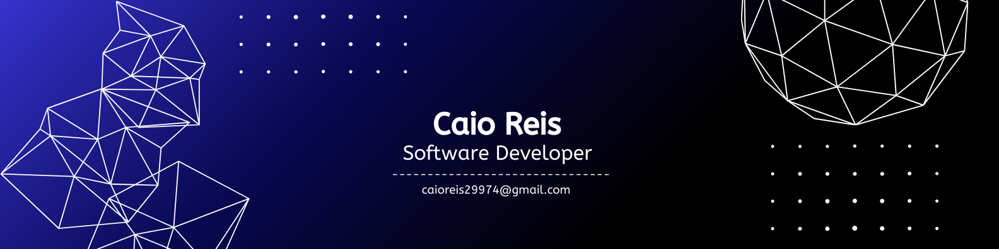

  

  

    Estudante de Análise e Desenvolvimento de Sistemas na Uninassau 
    Estou em constante atualização e buscando novos desafios na área de tecnologia. 
    Tenho paixão por aprender e aplicar esse conhecimento para criar soluções inovadoras. 
    <code>console.log("A essência é o aprendizado contínuo.");</code>

#

  <h3>Connect with me!</h3>

  
  
  

  <h3>My Stack ~</h3>

  
   
  
  

#

  <h3> GitHub Stats </h3>
  
      

  <picture>
    <source media="(prefers-color-scheme: dark)" srcset="https://raw.githubusercontent.com/caioreis29974/caioreis29974/output/github-contribution-grid-snake-dark.svg">
    <source media="(prefers-color-scheme: light)" srcset="https://raw.githubusercontent.com/caioreis29974/caioreis29974/output/github-contribution-grid-snake-dark.svg">
    
  </picture>

  

